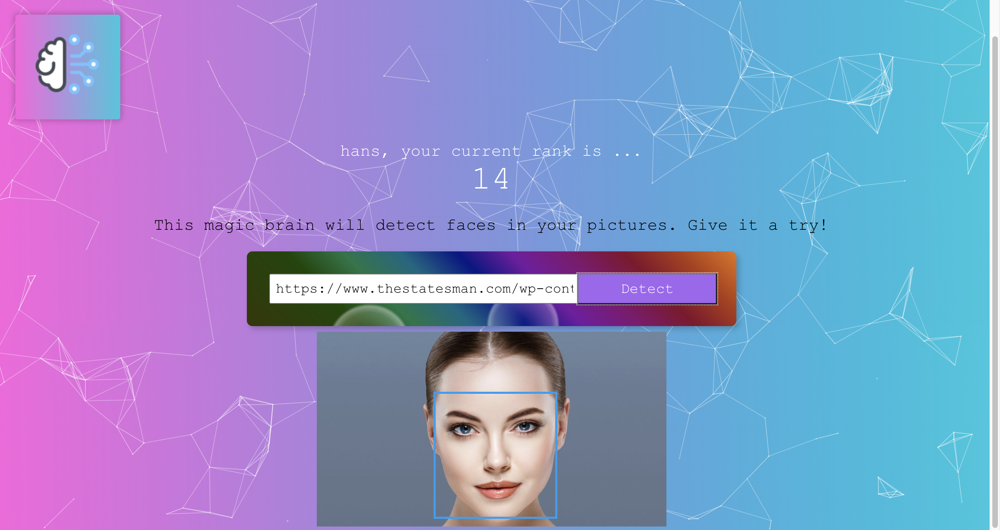

# Face Recognition App

React app built with  Clarifai Face Recognition api. User authentication is secured through bcrypt and data is stored through knex PostGres. Users can sign in and sign up the app, whenever they make a new search for an image, their point increases.